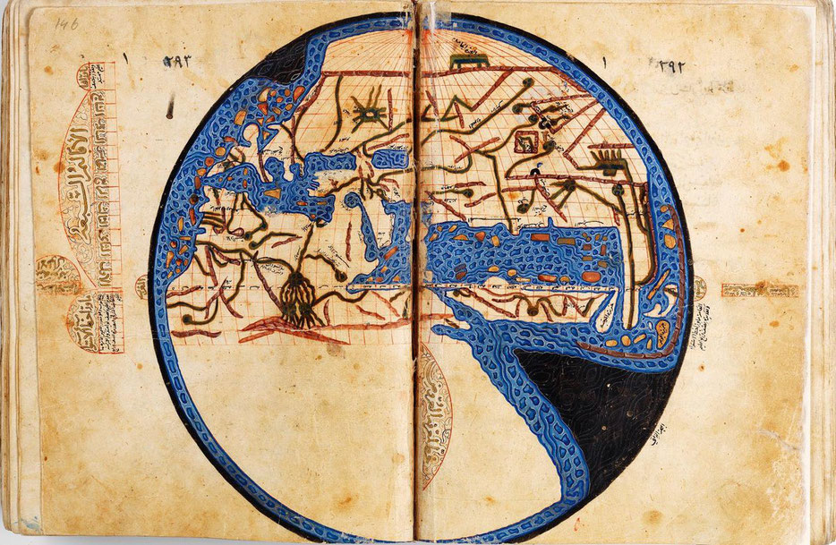

# Reveal.JS Classroom

## Islamic Maps

  
    

### Documento cartográfico 1

Universiteit Leiden
Abu Isḥāq Ibrāhīm ibn Muḥammad al-Iṣṭakhrī, 1193
https://digitalcollections.universiteitleiden.nl/view/item/1577846
http://hdl.handle.net/1887.1/item:1577846

### Documento cartográfico 2

Book of Curiosities, Anónimo. Anónimo, copia del siglo XIII de un original escrito en la segunda mitad del siglo XI y conservado en la Bodleian Library de Oxford
Bodleian Library MS. Arab. c. 90
https://digital.bodleian.ox.ac.uk/inquire/p/36ebabd9-4d62-4d8e-8e7b-1afd048e872e

### Documento cartográfico 3

Kitāb al-masālik wa-'l-mamālik. Bibliothek Erfurt/Gotha, Ms. orient. A 1521

https://archive.thulb.uni-jena.de/ufb/receive/ufb_cbu_00011296?derivate=ufb_derivate_00010485
https://archive.thulb.uni-jena.de/ufb/rsc/viewer/ufb_derivate_00010485/Ms-orient-A-01521_000.tif?logicalDiv=log_c5f88250-712e-453c-82a7-0ec00d6b3626

## Artículos
https://muslimheritage.com/unpublished-arabic-geography/
https://histoireislamique.wordpress.com/2014/05/05/carte-du-monde-faite-par-les-geographes-abbasside-du-calife-al-mamun-813-833/
https://www.aramcoworld.com/Articles/November-2019/Messages-in-the-Maps
https://www.academia.edu/1153023/Surat_Bahr_al_Rum_Picture_of_the_Sea_of_Byzantium_Possible_Meanings_Underlying_the_Forms

## Bibliografía 

* 2009 - Cartography in Islamic Societies, S. Brentjes - [enlace](https://www.academia.edu/625019/Cartography_in_Islamic_Societies)

* 1979 - La escuela cartográfica de Balkhi - Gerald R. Tibbets - [enlace](https://press.uchicago.edu/books/HOC/HOC_V2_B1/HOC_VOLUME2_Book1_chapter5.pdf)

## Reveal.JS Documentation

reveal.js is an open source HTML presentation framework. It enables anyone with a web browser to create fully featured and beautiful presentations for free. [Check out the live demo](https://revealjs.com/).

The framework comes with a broad range of features including [nested slides](https://revealjs.com/vertical-slides/), [Markdown support](https://revealjs.com/markdown/), [Auto-Animate](https://revealjs.com/auto-animate/), [PDF export](https://revealjs.com/pdf-export/), [speaker notes](https://revealjs.com/speaker-view/), [LaTeX support](https://revealjs.com/math/), [syntax highlighted code](https://revealjs.com/code/) and much more.
The full reveal.js documentation is available at [revealjs.com](https://revealjs.com).

[Get Started](https://revealjs.com/installation)

Want to create your presentation using a visual editor? Try the official reveal.js presentation platform for free at [Slides.com](https://slides.com). It's made by the same people behind reveal.js.

## License

MIT licensed

Copyright (C) 2011-2020 Hakim El Hattab, https://hakim.se
